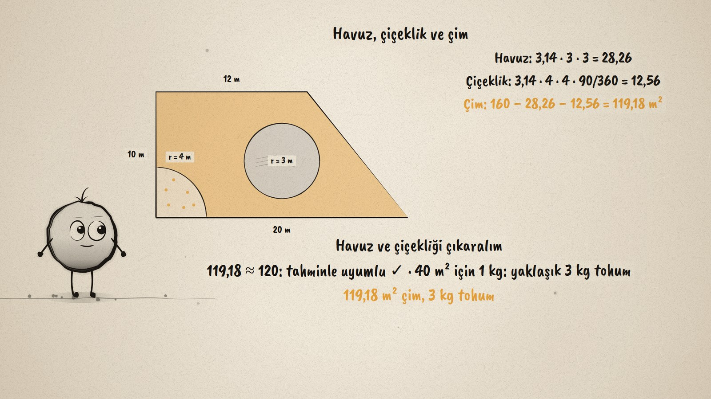
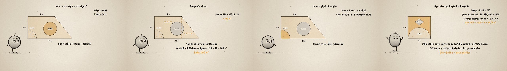

# Bahçe Planı · Area Problems with Circles and Trapezoids

**▶ Tarayıcıda izleyin / Watch in the browser:** https://hakanatas.github.io/bahce-plani/ 
**⬇ MP4 + altyazılar / MP4 + subtitles:** [Releases](https://github.com/hakanatas/bahce-plani/releases) 
**✎ Kullanılan istem / The prompt behind it:** [PROMPT.md](PROMPT.md) 
**🎞 Bütün filmler / All films:** [Nokta'nın Filmleri](https://hakanatas.github.io/nokta-filmleri/?sinif=7)

> **TR —** 7. sınıf matematik "Geometrik Nicelikler" temasındaki MAT.7.4.10 öğrenme çıktısı için hazırlanmış, tamamen JavaScript ile çizilen 92 saniyelik mürekkep animasyonu. Bir bahçe planı: tabanları 20 m ve 12 m, yüksekliği 10 m olan bir dik yamuk; ortada yarıçapı 3 m olan bir havuz, köşede yarıçapı 4 m olan çeyrek daire bir çiçeklik. Kalan yere çim ekilecek; 40 m² için 1 kg tohum gerekiyor. Bileşenler belirleniyor (yamuk, daire, daire dilimi), çim "bahçe − havuz − çiçeklik" olarak ifade ediliyor ve yaklaşık 120 m² tahmin ediliyor. Bahçeyi dikdörtgen sayan strateji bırakılıyor; yamuk bağıntısıyla 160 m², dikdörtgen + üçgen ile kontrol. Havuz 28,26 m², çiçeklik 12,56 m², çim 119,18 m²: tahminle uyumlu, yaklaşık 3 kg tohum. Son olarak strateji yeni bir bahçeye genelleniyor: yarım daire çiçeklikli, eşkenar dörtgen havuzlu 10 m'lik kare, 54,75 m² çim. Altyazılar Türkçe, İngilizce ya da ikisi birlikte seçilebilir.

A 92-second ink animation for **7th-grade maths**. Nokta, the ink character from [The Learning Ink](https://github.com/hakanatas/the-learning-ink), is the guide again. A plan is data in `scenes/scene1.js`: an outer polygon and a list of holes (a circle, a sector, a semicircle, a rhombus); `garden` fills the grass with the even-odd rule, so the amber area on screen is exactly "the whole minus the shapes inside" that the film computes.

## Learning outcome

MEB, Türkiye Yüzyılı Maarif Modeli, Ortaokul Matematik, 7th grade, "Geometrik Nicelikler" theme:

**MAT.7.4.10. Günlük hayat durumlarında daire, daire dilimi, eşkenar dörtgen ve yamuğun alanına ilişkin problem çözebilme**
- a) Günlük hayat durumlarında daire, daire dilimi, eşkenar dörtgen ve yamuğun alanlarına ilişkin problemde ilgili matematiksel bileşenleri belirler.
- b) Matematiksel bileşenler arasındaki ilişkileri belirler.
- c) Problem bağlamındaki temsilleri farklı temsillere dönüştürür.
- ç) Matematiksel temsillere dönüştürdüğü problemi kendi ifadeleri ile açıklar.
- d) Problemin sonucuna ilişkin tahminde bulunur ve işlemleri gerçekleştirmek için stratejiler geliştirir.
- e) Belirlenen stratejileri çözüm için uygular.
- f) Çözüm yollarını kontrol eder ve çözüme ulaştırmayan stratejiyi değiştirir.
- g) Problemin çözümü için kullandığı veya geliştirdiği stratejileri gözden geçirerek alternatif çözüm yollarını değerlendirir.
- ğ) Kullandığı strateji veya stratejileri farklı problemlerin çözümlerine geneller.
- h) Genellemenin geçerliliğini matematiksel örneklerle değerlendirir.

## Scenes

| # | Time | Scene | What happens | Outcome |
|---|---|---|---|---|
| 1 | 0–10 s | Bahçe | A trapezoid garden with a pool and a quarter-circle flowerbed: how much grass and seed? | a |
| 2 | 10–28 s | Bileşenler | Trapezoid, circle, sector; grass = garden − pool − bed; estimate ≈ 120 m². | a, b, c, ç, d |
| 3 | 28–46 s | Bahçenin alanı | The rectangle strategy is dropped; (20 + 12) / 2 · 10 = 160, checked as 120 + 40. | e, f, g |
| 4 | 46–64 s | Çim | Pool 28,26, bed 12,56, grass 119,18 m² (fits the estimate), about 3 kg of seed. | e, f |
| 5 | 64–80 s | Yeni bahçe | A square with a semicircle bed and a rhombus pool: 54,75 m² of grass. | ğ, h |
| 6 | 80–92 s | Aklında kalsın | The whole minus the shapes inside. | a–h |

## Running it

- **Preview:** double-click `index.html` (it works offline).
- **MP4:** run `npm install` once, then `npm run export -- --format=horizontal --captions=tr`.
- **Subtitles and narration:** `npm run srt` writes `out/captions_*.srt` and `narration_notes.txt`.
- **Editing:**
  - Caption text, timings and narration notes: `captions.js`
  - Everything on screen is drawn by `LI.world(t)` in `scenes/scene1.js` (the plans, the steps, the words); the other scenes only set the camera.
  - Nokta's poses: `src/draw/film.js`; layout for 16:9 and 9:16: `src/draw/kd.js`

It uses the same engine as The Learning Ink: `renderFrame(t)` as a pure function of time, seeded randomness, and frame-by-frame export.

## Lisans · License

**TR —** Bu film ve kodu [Creative Commons Atıf-GayriTicari 4.0 Uluslararası (CC BY-NC 4.0)](https://creativecommons.org/licenses/by-nc/4.0/deed.tr) lisansıyla paylaşılır. Ticari olmayan her amaçla (derste, okulda, eğitim materyalinde) kopyalayabilir, paylaşabilir ve değiştirebilirsiniz; ancak **kaynak göstermek zorunludur**: eser sahibinin adı ve bu deponun bağlantısı belirtilmeden kullanılamaz. Ticari kullanım (satış, ücretli ürün ya da yayın) için izin alınmalıdır.

**EN —** This film and its code are licensed under [Creative Commons Attribution-NonCommercial 4.0 International (CC BY-NC 4.0)](https://creativecommons.org/licenses/by-nc/4.0/). You may copy, share and adapt them for non-commercial purposes, but **attribution is required**: they may not be used without crediting the author and linking to this repository. Commercial use requires permission.

Atıf örneği / Required credit: *“Bahçe Planı”, Hakan Ataş, Nokta'nın Filmleri — https://github.com/hakanatas/bahce-plani — CC BY-NC 4.0*
